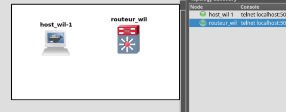
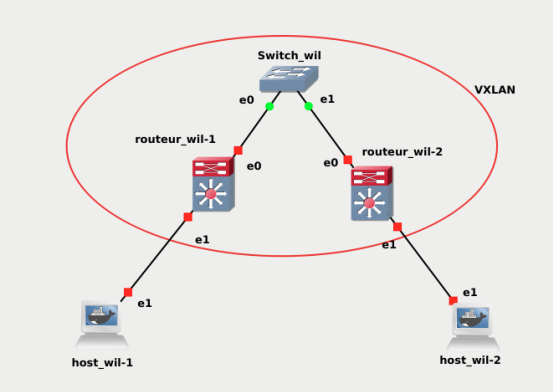
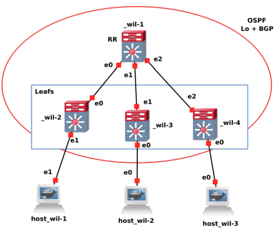

# Bgp At Doors of Autonomous Systems is Simple (badass)
Simulate multiple VxLAN networks and configure them using GNS3 with docker images
## Introduction
VxLAN is an encapsulation protocol that provides data center connectivity using tunneling to stretch Layer 2 connections over an underlying Layer 3 network. In data centers, VxLAN is the most commonly used protocol to create overlay networks that sit on top of the physical network, enabling the use of virtual networks.
## Part 1
Discovering the bare-bones of a VxLAN network
- Dockers OS Selection
	- `alpine` for hosts
	- `frrouting` for routers
- Router services configuration via `vtysh` shell
	- BGPD
	- OSPFD
	- IS-IS
- Host configuration
	- Busybox software suite

## Part 2
Set up a basic network model with multicast VxLAN enabled
- First in `static unicast` then in `dynamic multicast`
- The network must be using a VxLAN with an ID of 10
- Setup `br0` to act like a bridge between `eth1` and the `vxlan` interface

## Part 3
Set up a more advanced network and explore the principe of the BGP EVPN
- The network must be using a VxLAN with an ID of 10
- We are going to use the principle of the `route reflection`
- Our `leafs` will be configured to have `dynamic` relations.
- To simplify the evaluation, we must choose `OSPF` service instead of `IS-IS`
- `leafs` routers must be able to automatically discover the `MAC addresses` of functional machines, `type 2` routes must be created accordingly

## Notes
- All parts are pushed with a `readme.txt` file that explains the config files
- GNS3 Projects for all parts are available through `PX.gns3projet`
- Through the whole project, we consider the network in the same `autonomous system (AS)` only `iBGP` services are involved for router communication
